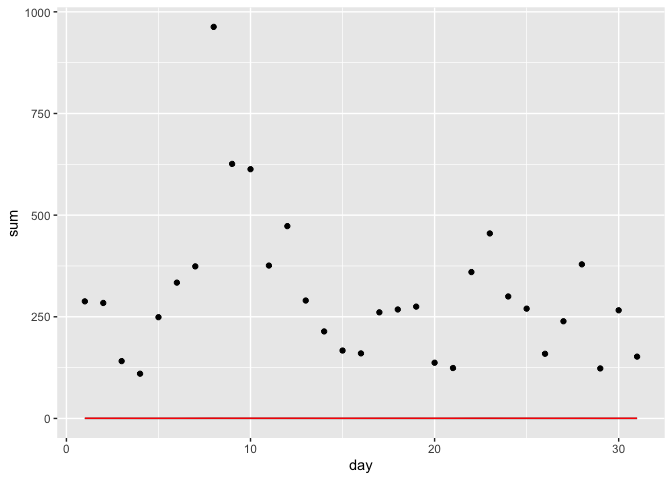
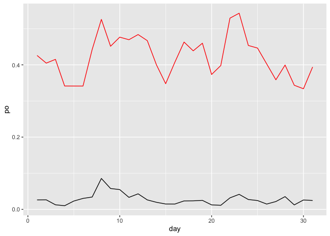

HW1
================
2022-09-22

### question 1

> How many flights have a missing dep_time? What other variables are
> missing? What might these rows represent?

``` r
ques1 = flights %>% 
  group_by(tailnum) %>% 
  summarise(missing_dep_time = sum(is.na(dep_time)), n = n()) %>% 
  arrange(desc(missing_dep_time))

ques1_b = ques1 %>% 
  filter(missing_dep_time == 1)

nrow(ques1)
```

    ## [1] 4044

``` r
nrow(ques1_b)
```

    ## [1] 620

``` r
other = sapply(flights, function(x) sum(is.na(x)))
la = labels(other[other > 0])
la
```

    ## [1] "dep_time"  "dep_delay" "arr_time"  "arr_delay" "tailnum"   "air_time"

***4044 flights have missing dep_time***  
***“dep_time” “dep_delay” “arr_time” “arr_delay” “tailnum” “air_time”
are missing***  
***these rows might mean the flight have been cancelled, no dep and arr
time.***

### question 2

> Currently dep_time and sched_dep_time are convenient to look at, but
> hard to compute with because they’re not really continuous numbers.
> Convert them to a more convenient representation of number of minutes
> since midnight.

``` r
ques2 = flights %>% 
  mutate(dep_time = (dep_time %/% 100) * 60 + (dep_time %% 100), sched_dep_time = (sched_dep_time %/% 100) * 60 + (sched_dep_time %% 100))
tail(ques2,10)
```

    ## # A tibble: 10 × 19
    ##     year month   day dep_time sched_de…¹ dep_d…² arr_t…³ sched…⁴ arr_d…⁵ carrier
    ##    <int> <int> <int>    <dbl>      <dbl>   <dbl>   <int>   <int>   <dbl> <chr>  
    ##  1  2013     9    30     1360       1370     -10    2347       7     -20 B6     
    ##  2  2013     9    30     1361       1366      -5    2345       1     -16 B6     
    ##  3  2013     9    30     1387       1375      12    2359    2358       1 B6     
    ##  4  2013     9    30     1429       1439     -10     325     350     -25 B6     
    ##  5  2013     9    30       NA       1122      NA      NA    2019      NA EV     
    ##  6  2013     9    30       NA        895      NA      NA    1634      NA 9E     
    ##  7  2013     9    30       NA       1320      NA      NA    2312      NA 9E     
    ##  8  2013     9    30       NA        730      NA      NA    1330      NA MQ     
    ##  9  2013     9    30       NA        719      NA      NA    1344      NA MQ     
    ## 10  2013     9    30       NA        520      NA      NA    1020      NA MQ     
    ## # … with 9 more variables: flight <int>, tailnum <chr>, origin <chr>,
    ## #   dest <chr>, air_time <dbl>, distance <dbl>, hour <dbl>, minute <dbl>,
    ## #   time_hour <dttm>, and abbreviated variable names ¹​sched_dep_time,
    ## #   ²​dep_delay, ³​arr_time, ⁴​sched_arr_time, ⁵​arr_delay

### question 3

> Look at the number of canceled flights per day. Is there a pattern? Is
> the proportion of canceled flights related to the average delay? Use
> multiple dyplr operations, all on one line, concluding with
> ggplot(aes(x= ,y=)) + geom_point()

``` r
#[1] "dep_time"  "dep_delay" "arr_time" 
#[4] "arr_delay" "tailnum"   "air_time" 

ques3 = flights %>% 
  mutate(cancel = (is.na(dep_time)) | (is.na(dep_delay)) | (is.na(arr_time)) | (is.na(arr_delay)) | (is.na(air_time)), delay = if_else(condition = arr_delay > 0,
                                    true = T,
                                    false = F,
                                    missing = T)) %>% 
  group_by(day) %>% 
  summarise(po = mean(cancel), sum = sum(cancel), ave_delay = mean(delay),n = n())
ques3 %>% 
  ggplot(aes(x = day)) +
    geom_point(aes(y = sum)) +
    geom_line(aes(y = po)) +
    geom_line(aes(y = ave_delay), colour = "red")
```

<!-- -->

``` r
ques3 %>% 
  ggplot(aes(x = day)) +
    geom_line(aes(y = po)) +
    geom_line(aes(y = ave_delay), colour = "red")
```

<!-- -->

``` r
print(ques3, n=31)
```

    ## # A tibble: 31 × 5
    ##      day      po   sum ave_delay     n
    ##    <int>   <dbl> <int>     <dbl> <int>
    ##  1     1 0.0261    288     0.426 11036
    ##  2     2 0.0263    284     0.405 10808
    ##  3     3 0.0126    141     0.415 11211
    ##  4     4 0.00995   110     0.341 11059
    ##  5     5 0.0229    249     0.341 10858
    ##  6     6 0.0302    334     0.341 11059
    ##  7     7 0.0340    374     0.443 10985
    ##  8     8 0.0854    963     0.526 11271
    ##  9     9 0.0577    626     0.451 10857
    ## 10    10 0.0546    613     0.477 11227
    ## 11    11 0.0331    376     0.469 11359
    ## 12    12 0.0429    473     0.484 11029
    ## 13    13 0.0261    290     0.467 11108
    ## 14    14 0.0194    214     0.400 11008
    ## 15    15 0.0148    167     0.348 11317
    ## 16    16 0.0147    160     0.407 10918
    ## 17    17 0.0233    261     0.463 11222
    ## 18    18 0.0235    268     0.439 11399
    ## 19    19 0.0248    275     0.460 11086
    ## 20    20 0.0123    137     0.373 11111
    ## 21    21 0.0111    124     0.398 11141
    ## 22    22 0.0317    360     0.529 11345
    ## 23    23 0.0415    455     0.543 10966
    ## 24    24 0.0272    300     0.454 11041
    ## 25    25 0.0243    270     0.446 11097
    ## 26    26 0.0146    159     0.402 10883
    ## 27    27 0.0216    239     0.359 11084
    ## 28    28 0.0352    379     0.399 10773
    ## 29    29 0.0123    123     0.343 10039
    ## 30    30 0.0259    266     0.334 10289
    ## 31    31 0.0246    152     0.394  6190
